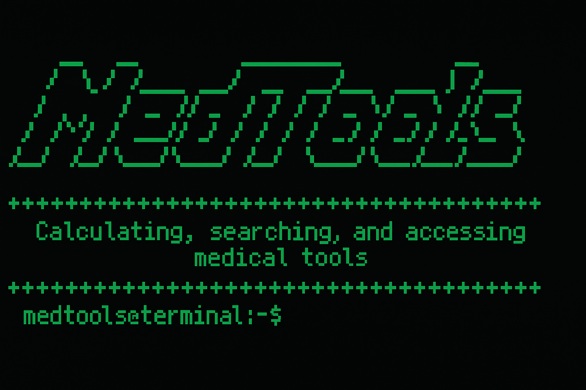

    

A Python-Based Terminal Application for Medical Practice.

MedTools is a lightweight terminal application written in Python, designed to perform calculations, search, and quickly retrieve information from a structured database to support medical practice.

The goal of this application is to offer a versatile and efficient tool, providing concise, high-quality information — just what is necessary, with no distractions.

While primarily intended for personal use and educational purposes, MedTools can also be incorporated into daily workflows by healthcare professionals. For mobile use, it is recommended to run it through Termux.

Discontinued 30/04/2025